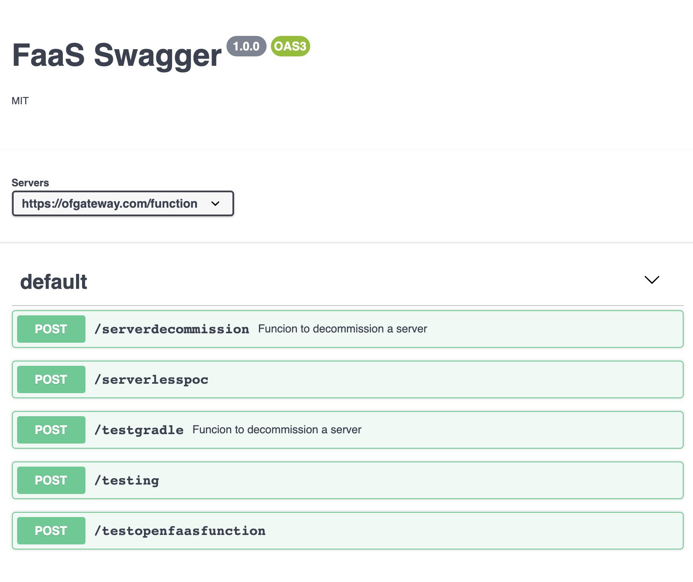

# Swagger for Openfaas

Swagger interface for openfaas functions

### Whats it About

* Swagger end point for openfaas function
* Uses the annotations in the function descriptor yml to pull the swagger config.
* Test functions from swagger ui

----------------

### Demo

----------------

### Build and Deploy the Utility

Use the make file to build the utility. The make file request for 3 parameters.

 1. Path where this utility is going to serve the swagger.yml
 2. Openfaas gateway. If you are planning to deploy this utility in the same namsepace as openfaas (which we recomend) the url will be http://gateway:8080
 3. Your docker hub where this utility image will be pushed

All the artifacts will be stored in the .deploy folder.

Once built, push image to the repo and deploy with k8.yaml in .deploy folder

-------------

### Using the utility

Add your api spec (json format) in the function descriptor as annotation. Use this [example](./example.yaml).

After deploying your function with this annotation, you should be able see the paths in swagger ui

* We are following open api 3.0 spec
* Please make sure the json is well formatted.
* In swagger 3.0, the spec is defined in yaml. You can define in yaml and convert to json using online editor like [this](https://codebeautify.org/yaml-to-json-xml-csv)
* If annotatation is not provided , by default just the path will be shown.

---------

### Authentication

Currently does not support Openfaas auth plugins. But will work if openfaas is deployed behind a proxy and the proxy is handling the auth needs.

----------
### Contributing to the Project
The team is open to contributions to our project. For more details, see our [Contribution Guide.](./docs/CONTRIBUTING.md)