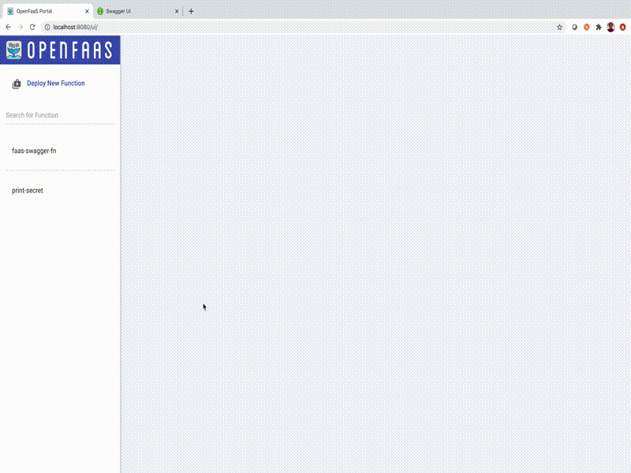

# Swagger for Openfaas

Swagger interface for openfaas functions

### Whats it About

* Document your Openfaas functions in OpenAPI 3.0 Spec and visualize it in a swagger ui.
* Uses the annotations in the function descriptor yml to look for the swagger config.
* Test functions from swagger ui

----------------



----------------

### Function

Navigate to the [function](./function) folder to deploy the swagger yaml generator.

-----------------

### UI

The function will generate the swagger yaml. To visualize, deploy the swaggerui-proxy component as below 

```
ko apply -RBf config/
```

Once the component is created access the ui at `/swaggerui/` path.

------------------

### Usage

Add your api spec (json format) in the function descriptor(stack.yaml) as annotation. Use this [example](./example.yaml).

After deploying your function with this annotation, you should be able see the paths in swagger ui

* We are following open api 3.0 spec
* Please make sure the json is well formatted.
* In swagger 3.0, the spec is defined in yaml. You can define in yaml and convert to json using online editor like [this](https://codebeautify.org/yaml-to-json-xml-csv)
* If annotatation is not provided , by default just the path will be shown.

---------

### Authentication

Supports the basic auth plugin.

Implement the [OFAuth](./pkg/auth/auth.go) interface for other options

-----------------

### GO Packages

The [swagger](./pkg/swagger) package can be used as a standalone in your GO function. 

----------
### Contributing to the Project
The team is open to contributions to our project. For more details, see our [Contribution Guide.](./docs/CONTRIBUTING.md)
